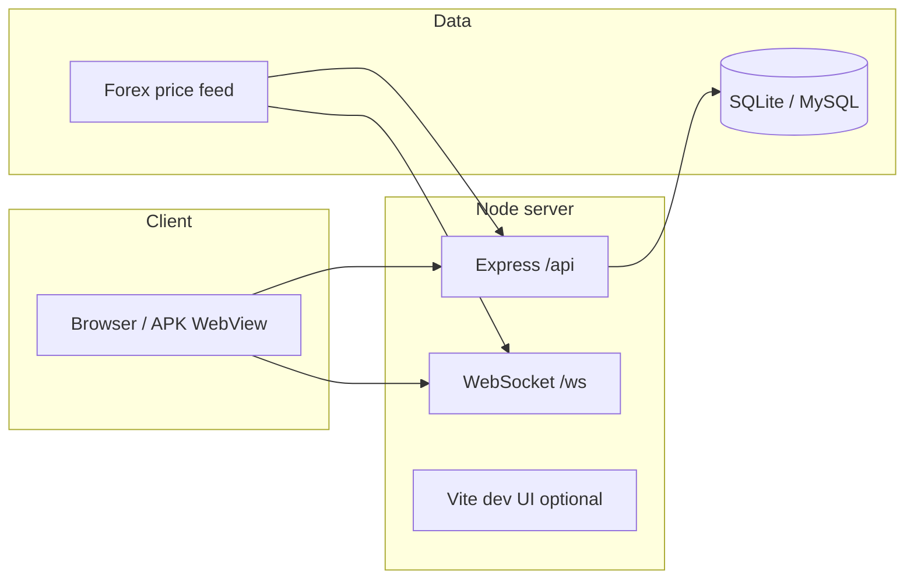

# How this project works (Iqfx Pro)

Overview of the full flow. For technical detail see root **`README.md`**; for server deploy see **`DEPLOY.md`**.

---

## 1. What is it?

**Iqfx Pro** is a **full-stack trading web app**:

- **Frontend:** React (splash → landing → login/register → trading dashboard)
- **Backend:** Node.js + Express (**REST API** + **WebSocket** for live prices)
- **Database:** SQLite (`data/app.db`) **or** MySQL (via `.env`)
- **Android:** optional **APK** that opens your **live website** in a WebView (`mobile-apk/`)

Users can trade **Up / Down** binary-style contracts from a **Demo** (virtual) or **Live** (after deposit) wallet.

---

## 2. Architecture (high level)

- **Production / `npm start`:** Node serves static **`frontend/dist`** + **`/api`** + **`/ws`**
- **Development `npm run dev`:** often **same port** for Vite + API (UI can run without a separate build)

---

## 3. Folder structure (main)

| Folder / file | Purpose |
|----------------|---------|
| **`src/`** | Backend: `server.ts` (routes), `services/*` (auth, wallet, deposits, referral…), `db/appDb.ts` |
| **`frontend/src/`** | React app: `App.tsx` (main UI), `LandingPage.tsx`, `api.ts` (fetch helpers) |
| **`frontend/public/`** | Static assets (brand images, `downloads/` APK copy) |
| **`mobile-apk/`** | Capacitor Android shell — **`server.url`** in `capacitor.config.json` = live site |
| **`releases/`** | Optional: place **`Iqfxpro.apk`** on the server for the download route |
| **`.env`** | `PORT`, `AUTH_SECRET`, MySQL, USDT address, `APK_FILE_PATH`, etc. |

---

## 4. User journey (step-by-step)

1. **Open site** → splash → **landing** (marketing, APK link, login/register).
2. **Register**  
   - Desktop: name + email + password (+ optional referral)  
   - Mobile (small screen): name + password (+ referral) — email may be **auto**; login with **User ID**  
3. **Login** → JWT stored in browser **localStorage** as session.
4. **Dashboard**  
   - Header: **Demo | Live** toggle  
   - **Demo:** virtual balance — practice with **API + rules**  
   - **Live:** real balance (INR ledger) — after deposit / withdraw  
5. **Trade**  
   - Pair, time, amount, **Up / Down**  
   - **Live** binary: stake debited from wallet, win/loss at expiry  
   - **Demo:** separate in-memory + DB demo balance (guest betting disabled — **after login** demo)

---

## 5. Authentication

- **Register / Login** → `POST /api/auth/register`, `POST /api/auth/login`
- **JWT** header: `Authorization: Bearer <token>`
- **`/api/auth/me`** — current user  
- Password **hash + salt** in DB; plain password not stored

---

## 6. Wallet & ledger

- **`wallets`** row per user: **live `balance`** (INR-style units), **`demo_balance`**
- Movements in **`transactions`**: `txn_type` (e.g. `deposit_credited`, `binary_stake`, `binary_settle_win`, `level_income`, …)
- **Live** binary win credit ≈ **stake × multiplier** (code: `BINARY_WIN_PAYOUT_MULTIPLIER`, e.g. 1.8×)
- **Referral / level income:** small **% of stake** to uplines on live bets (DB: `referral_level_settings`)

---

## 7. Markets & real-time data

- Backend holds a **forex feed** (ticks)
- **`/api/markets`** — snapshot  
- **`/ws`** — live updates to the browser (prices, optional user snapshot when token is sent)  
- Chart history: **`/api/markets/history`** + DB ticks

---

## 8. Deposits & withdrawals

- **Deposit:** user sends USDT (BEP20) — intent / tx submit / admin approve (see `depositStore`, admin)
- On approve: **ledger** credit (INR rate from config)
- **Withdraw:** amount, address, TPIN/TOTP flow — ledger debit / pending states

---

## 9. Admin panel

- **`/admin`** or **`admin.html`** — React-Admin UI  
- User must have **`role = admin`** in DB  
- Deposits, withdrawals, users, transactions, **user insights**, **referral %** settings, etc.

---

## 10. Android APK

- The APK is not a separate app logic stack — a **WebView** loading **`https://your-domain.com`**
- **Website updates** usually **do not require a new APK** (rebuild mainly for URL / native changes)
- **Download:** default **`/api/system/android-apk`** — file from `releases/`, `APK_FILE_PATH`, or `frontend/dist/downloads/`

---

## 11. Common commands

| Command | Meaning |
|---------|---------|
| `npm run dev` | Dev: UI + API on one port (default 3000) |
| `npm run build` | Backend TypeScript → `dist/` |
| `npm run build:all` | Backend build + frontend install + frontend production build |
| `npm start` | Production: `node dist/index.js` |
| `npm run copy-apk` | Copy APK from Android build → `frontend/public/downloads/` |

---

## 12. Deploy (short)

- PC: `git push`  
- Server: `git pull` → **`npm run build:all`** → **`pm2 restart`**  
- Details: **`DEPLOY.md`**

---

## 13. Legal / risk note

Trading / binary products are not allowed in every jurisdiction. This document explains **technical architecture** only — **business, legal, and tax** are your responsibility.
