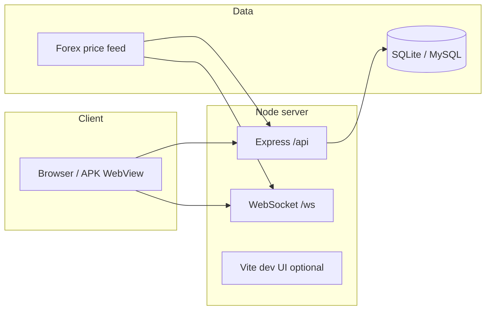

# Yeh project kaise kaam karta hai (UpDown FX)

Roman Urdu + English — poora flow samajhne ke liye. Technical detail ke liye root **`README.md`** aur server deploy ke liye **`DEPLOY.md`** dekho.

---

## 1. Short mein kya hai?

**UpDown FX** ek **full-stack trading web app** hai:

- **Frontend:** React (splash → landing → login/register → trading dashboard)
- **Backend:** Node.js + Express (**REST API** + **WebSocket** live prices ke liye)
- **Database:** SQLite (`data/app.db`) **ya** MySQL (`.env` se)
- **Android:** optional **APK** jo WebView mein tumhari **live website** kholta hai (`mobile-apk/`)

User **Demo** (virtual money) ya **Live** (deposit ke baad) wallet se **Up / Down** binary-style trades kar sakta hai.

---

## 2. Architecture (high level)

- **Production / `npm start`:** Node **`frontend/dist`** se static HTML/JS serve karta hai + **`/api`** + **`/ws`**
- **Development `npm run dev`:** aksar **same port** par Vite + API (build bina UI chal sakti hai)

---

## 3. Folder structure (main)

| Folder / file | Kaam |
|---------------|------|
| **`src/`** | Backend: `server.ts` (routes), `services/*` (auth, wallet, deposits, referral…), `db/appDb.ts` |
| **`frontend/src/`** | React app: `App.tsx` (main UI), `LandingPage.tsx`, `api.ts` (fetch helpers) |
| **`frontend/public/`** | Static assets (brand images, `downloads/` APK copy) |
| **`mobile-apk/`** | Capacitor Android shell — `capacitor.config.json` mein **`server.url`** = live site |
| **`releases/`** | Optional: server par **`UpDownFX.apk`** yahan rakh sakte ho — download route |
| **`.env`** | `PORT`, `AUTH_SECRET`, MySQL, USDT address, `APK_FILE_PATH`, wagaira |

---

## 4. User journey (step-by-step)

1. **Site khulta hai** → splash → **landing** (marketing, APK link, login/register).
2. **Register**  
   - Desktop: naam + email + password (+ referral optional)  
   - Mobile (chhoti screen): naam + password (+ referral) — email server **auto** bana sakta hai; **User ID** se login  
3. **Login** → JWT token milta hai → browser **localStorage** mein session.
4. **Dashboard**  
   - Header: **Demo | Live** toggle  
   - **Demo:** virtual balance — practice, **API + rules** se  
   - **Live:** real balance (INR ledger) — deposit / withdraw ke baad
5. **Trade**  
   - Pair, time, amount, **Up / Down**  
   - **Live** binary: stake wallet se cut, expiry par win/loss settle  
   - **Demo:** alag in-memory + DB demo balance (guest betting band — **login ke baad** demo)

---

## 5. Authentication (auth)

- **Register / Login** → `POST /api/auth/register`, `POST /api/auth/login`
- **JWT** header: `Authorization: Bearer <token>`
- **`/api/auth/me`** se current user
- Password **hash + salt** DB mein; plain password store nahi

---

## 6. Wallet & ledger (paisa ka hisaab)

- Har user ke liye **`wallets`** row: **live `balance`** (INR style units), **`demo_balance`**
- Har movement **`transactions`** table mein: `txn_type` (jaise `deposit_credited`, `binary_stake`, `binary_settle_win`, `level_income`, …)
- **Live** binary jeet par credit ≈ **stake × multiplier** (code: `BINARY_WIN_PAYOUT_MULTIPLIER`, e.g. 1.8×)
- **Referral / level income:** live bet par upline ko chhota **% of stake** (DB: `referral_level_settings`)

---

## 7. Markets & real-time data

- Backend **forex feed** (ticks) hold karta hai
- **`/api/markets`** — snapshot
- **`/ws`** — browser ko live updates (prices, optional user snapshot jab token bhejo)
- Chart history: **`/api/markets/history`** + DB ticks

---

## 8. Deposits & withdrawals

- **Deposit:** user USDT (BEP20) bhejta hai — flow intent / tx submit / admin approve (details `depositStore`, admin)
- Approve par **ledger** mein credit (INR rate config se)
- **Withdraw:** amount, address, TPN/TOTP flow — ledger debit / pending states

---

## 9. Admin panel

- **`/admin`** ya **`admin.html`** — React-Admin UI
- User **`role = admin`** DB mein hona chahiye
- Deposits, withdrawals, users, transactions, **user insights**, **referral %** settings, wagaira

---

## 10. Android APK

- APK asli app nahi — **WebView** jo **`https://tumhara-domain.com`** load karta hai
- **Website update** = zyada tar **naya APK zaroori nahi** (sirf URL / native change par naya build)
- **Download link:** default **`/api/android-app.apk`** — server `releases/`, `APK_FILE_PATH`, ya `dist/public/downloads/` se file deta hai; **`/downloads/UpDownFX.apk`** bhi same file (legacy URL)

---

## 11. Common commands

| Command | Matlab |
|---------|--------|
| `npm run dev` | Dev: UI + API ek port (default 3000) |
| `npm run build` | Backend TypeScript → `dist/` |
| `npm run build:all` | Backend build + frontend install + frontend production build |
| `npm start` | Production: `node dist/index.js` |
| `npm run copy-apk` | Android build se APK copy → `frontend/public/downloads/` |

---

## 12. Deploy (short)

- PC: `git push`  
- Server: `git pull` → **`npm run build:all`** → **`pm2 restart`**  
- Detail: **`DEPLOY.md`**

---

## 13. Legal / risk note

Trading / binary products har jurisdiction mein allowed nahi. Ye doc **technical architecture** explain karti hai — **business, legal, tax** tumhari zimmedari.

---

*File: `docs/PROJECT-KAISE-KAAM-KARTA-HAI.md` — agar rename chaho to `PROJECT-HOW-IT-WORKS.md` bhi rakh sakte ho.*
